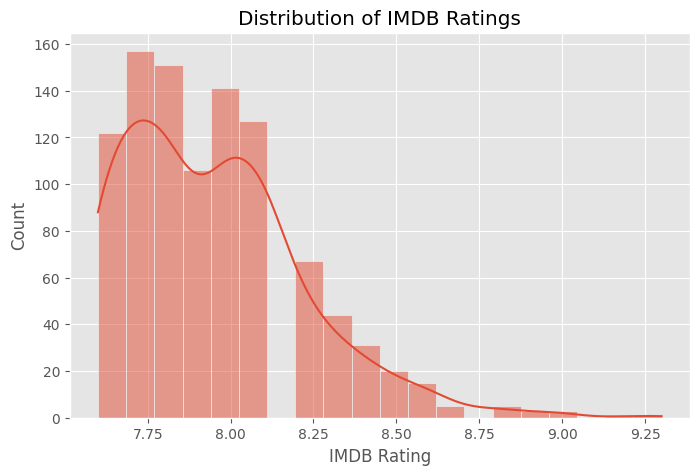
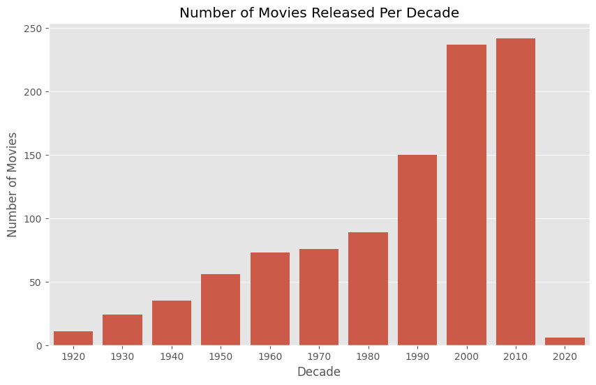

# IMDb Movies EDA & Visualization  Project

## 🔹 Project Overview
This project explores the IMDB Top 1000 Movies using Exploratory Data Analysis **(EDA)** and **data visualization techniques**.

The main goal of project is to analyze movie trends, ratings, genre, revenue patterns and relationships between different movie features using Python and analysis libraries.

The goal is to prepare a high-quality dataset ready for **data analysis** or **machine learning projects**.

---

## 🗂 Dataset
- Original dataset: `data/raw/imdb_raw.csv`
- Cleaned & enhanced dataset: `data/processed/imdb_clean.csv`
-The dataset contains information about IMDb Top 1000 movies, including:

- Movie title
- Release year
- Genre
- Runtime
- IMDb rating
- Meta score
- Director
- Number of votes
- Gross revenue

---

## 🧹 Data Cleaning Steps
1. Removed unnecessary columns:
   - Poster_Link, Overview, Certificate, Star2, Star3, Star4
2. Renamed columns for consistency (lowercase, snake_case)
3. Converted columns to proper data types:
   - released_year → numeric
   - runtime → numeric
   - gross → numeric
   - meta_score → numeric
4. Cleaned text columns:
   - genre → lowercase, stripped spaces
5. Handled missing values:
   - Dropped rows with missing critical values (imdb_rating, released_year, genre)
   - Filled numeric missing values with median (meta_score, gross)

---

## 🚀 Feature Engineering
New features were added to strengthen analysis and for CV impact:

| Feature | Description |
|---------|-------------|
| decade | Decade of movie release (e.g., 1990, 2000) |
| release_period | Categorized release period: Old / Middle / New |
| rating_category | IMDb rating category: Low / Average / High / Excellent |
| gross_category | Gross revenue category: Low / Medium / High |
| votes_per_million_gross | Popularity index combining votes and gross revenue |
| main_genre | First genre of the movie |
| genre_count | Number of genres for the movie |

---

## 🛠 Tools Used
- Python
- Pandas
- NumPy
- Matplotlib
- Seaborn
- Jupyter Notebook 

---

## 📈 Final Dataset Columns
- series_title  
- released_year  
- runtime  
- genre  
- imdb_rating  
- meta_score  
- director  
- star1  
- no_of_votes  
- gross  
- decade  
- release_period  
- rating_category  
- gross_category  
- votes_per_million_gross  
- main_genre  
- genre_count  

---

## Exploratory Data Analysis

The project includes:

- Univariate Analysis
- Bivariate Analysis
- Correlation Analysis
- Genre-based Analysis
- Decade-based Movie Trends
- Revenue Analysis

---

## Key Insight 

- Most movies have IMDb rating between 7 and 8.
- Drama is the most common genre in the dataset.
- Longer movies tend to receive slightly higher IMDb rating.
- Family and Action movies generate higher average gross revenue.
- Meta score and IMDb rating show weak positive relationship.
- Movie production increased significantly in the 2000s and 2010s.

---

## Sample Visualizations

### IMDb Rating Distribution


### Movies Per Decade


---

## Conclusion

This project demonstrates how exploratory data analysis can be used to uncover patterns, trends, and relationships within movie datasets. 

The analysis provides insights into audience preferences, movie popularity, and commercial success factors.

---

## 🔗 How to Run
1. Clone the repository:  
```bash
git clone https://github.com/MahdiYaqobi/imdb-data-cleaning-project
```

2. Go to the project folder:  
```bash
cd imdb-data-cleaning-project
```

3. Install requirements:  
```bash
pip install -r requirements.txt
```

4. Run the notebook:  
```bash
python -m notebook
```

5. Open:  
`notebooks/imdb_data_cleaning.ipynb`


